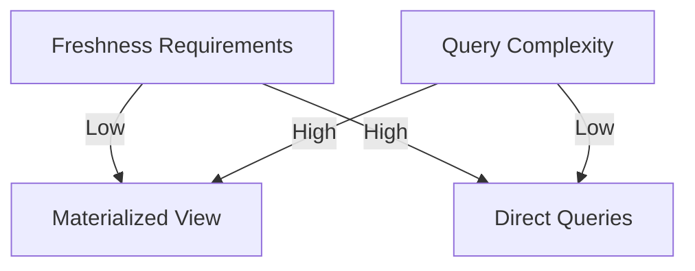
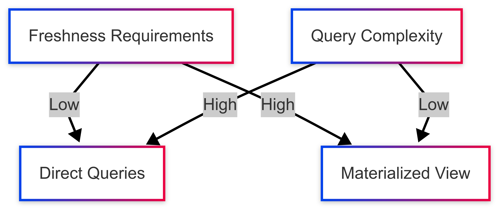

## Performance Considerations

### Trade-off Analysis

### Optimization Techniques
- **Indexing:** Add indexes on filtered/sorted columns
- **Partial Materialization:** Only store hot data subsets
- **TTL Expiration:** Automatically purge stale data
- **Sharding:** Distribute large materialized views
